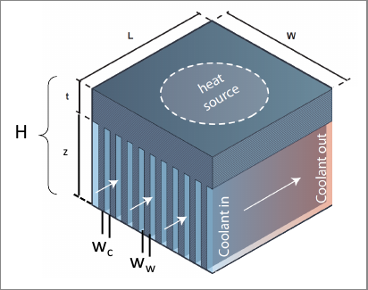

% Analysis of a Heat Sink in Microfluidic Applications  
% Lorenzo Vecchietti  
% December 2024  

# Problem Description  
The study focuses on a silicon chip that integrates cooling channels, with water acting as the coolant to effectively remove the heat generated by a uniform heat source applied to its surface. The chip features an array of cooling channels, each with specific geometric dimensions, and a solid material layer that separates the heat source from the cooling channels. The primary objective of this analysis is to determine the thermal resistance of the system and identify the optimal configuration of the cooling channels that will achieve the most efficient heat removal from the chip.

## Data  

| __Parameter__                   | __Value (SI Units)__    |
|----------------------------------|-------------------------|
| Width of the chip ($W$)          | $0.01$ m                |
| Length of the chip ($L$)         | $0.01$ m                |
| Height of the chip               | $5 \cdot 10^{-4}$ m     |
| Heat source intensity            | $8 \cdot 10^3$ W/m²     |
| Channel depth ($h_{fin}$)        | $4 \cdot 10^{-4}$ m     |
| Solid material thickness         | $1 \cdot 10^{-5}$ m     |
| Maximum pressure drop            | $50$ kPa                |
| Water inlet temperature          | $293.15$ K              |
| Silicon thermal conductivity     | $150$ W/m·K             |
| Water thermal conductivity       | $0.6$ W/m·K             |
| Water viscosity                  | $0.001$ Pa·s            |
| Water specific heat              | $4186$ J/kg·K           |

{ width=250px }

# Assumptions  

## Geometry  
We assume that the width of the cooling channels ($w_c$) is equal to the width of the fins ($w_w$), i.e., $w_c = w_w$. This assumption leads to the following relationship between the total width of the chip ($W$) and the number of fins ($n$):

$$
W = (2n + 1) \cdot w_c
$$

In this equation, $n$ represents the number of fins.

## Nusselt Number  
The Nusselt number ($Nu$) is a dimensionless number that characterizes the convective heat transfer at the boundary between a fluid and a solid. In the laminar flow regime, where the Reynolds number is less than $10^3$ (\( Re < 10^3 \)), the Nusselt number remains constant and is typically given by:

$$
Nu = 4.36
$$

We assume that the flow within each of the microfluidic channels remains laminar, which is generally the case for microchannels with small dimensions.

## Heat Transfer Modeling  
Heat transfer from the chip to the coolant occurs through three primary mechanisms:  

1. **Conduction through the solid material**:  
    $$ 
    R_{cond} = \frac{1}{t \cdot A_{chip}} 
    $$  
    where $t$ is the thickness of the solid material and $A_{chip}$ is the heat source area on the chip.  

2. **Convection between the channel walls and water**:  
    $$ 
    R_{conv} = \frac{1}{h \cdot A_{wall}} = \frac{1}{\frac{k_f \cdot Nu}{w_c} \cdot \frac{w_c + 2z}{2w_c} \cdot A_{chip}} 
    $$  
    where $h$ is the heat transfer coefficient, $k_f$ is the thermal conductivity of the fluid, and $z$ is the height of the channel.  

3. **Sensible heat transfer as the water absorbs heat**:  
    $$ 
    R_{heat} = \frac{1}{\rho c_p f} 
    $$  
    where $\rho$ is the coolant density, $c_p$ is the specific heat capacity of water, and $f$ is the volumetric flow rate.

The flow rate $f$ is derived using the Hagen-Poiseuille equation for a rectangular channel, assuming that the width of the channel ($w_c$) is much smaller than the height of the fin ($h_{fin}$):

$$
\Delta P = \frac{12 \mu L}{(1 - 0.63 \cdot \frac{w_c}{z}) \cdot n_c \cdot w_c^3 \cdot z} \cdot f
$$

where $n_c = n + 1$ represents the total number of channels.

The total thermal resistance is a combination of these three contributions, which allows for the calculation of the chip's surface temperature while ensuring that constraints on pressure drop and coolant flow are respected.

## Minimum Channel Width ($w_c$)  

In order to maintain the laminar flow assumption and to ensure that the Hagen-Poiseuille equation is applicable, we require that the channel width $w_c$ remains sufficiently small relative to the fin height $h_{fin}$. Specifically, the condition:

$$
w_c < h_{fin} \quad \Rightarrow \quad \frac{W}{2n+1} < h_{fin}
$$

results in the following constraint:

$$
n < 0.5 \left( \frac{W}{h_{fin}} - 1 \right) = 12
$$

This ensures that the channel width remains small enough for laminar flow, allowing the use of the Hagen-Poiseuille equation to determine the flow rate.

# Analysis  

## Sensible Heat Resistance  
The resistance to heat transfer due to sensible heat is inversely proportional to the coolant's density $\rho$, specific heat capacity $c_p$, and the volumetric flow rate $f$. As the flow rate increases, the heat resistance decreases.

The flow rate is constrained by the maximum pressure drop $\Delta P$ that the coolant pump can generate. The volumetric flow rate also decreases as the number of fins increases, primarily due to the increased skin friction between the fluid and the channel walls. Furthermore, the viscosity of the coolant limits the flow rate, as illustrated in the figures below.

{ width=500px}  

{ width=500px}  

The resistance associated with sensible heat, denoted as $R_{heat}$, is a function of the flow rate and is plotted in Figure \ref{r_heat}. As expected, the heat resistance increases with the number of fins because the flow rate decreases with a higher number of fins.

{ width=500px}

## Convective Heat Resistance  
Convective heat resistance is influenced by two primary factors:

1. The increase in heat transfer area due to the addition of fins.
2. The increase in the heat transfer coefficient as the Reynolds number rises.

Both factors contribute to a reduction in convective resistance as the number of fins increases. The convective resistance $R_{conv}$ is inversely proportional to these factors. As shown in Figure \ref{r_conv}, the convective resistance decreases as the number of fins increases.

{ width=500px}

## Conductive Heat Resistance  
The conductive resistance, which is modeled based on the thermal conductivity of the solid material, remains constant regardless of the number of fins. Using the provided parameters, the conductive resistance is calculated as:

$$
R_{cond} = 6.67 \times 10^3 \, \mathrm{\frac{K}{W}}
$$

## Total Resistance  
The total thermal resistance is the sum of the conductive, convective, and sensible heat resistances. Initially, as the number of fins increases, the total resistance decreases. However, beyond around 64 fins, the resistance due to sensible heat becomes dominant, causing the total resistance to increase. This behavior is clearly visible in Figure \ref{r_tot}, which plots the total resistance as a function of the number of fins.

{ width=500px}  

The temperature of the chip follows a similar trend. As the number of fins increases, the temperature of the chip decreases up to the optimal point, after which the temperature begins to rise again due to the increased resistance.

{ width=500px}

# Discussion  

## Optimal Number of Fins  
From the analysis, it is evident that there is an optimal number of fins at which the total thermal resistance is minimized, resulting in the lowest possible temperature on the chip. For the given configuration, 64 fins yield the best performance, providing the optimal balance between heat dissipation and system constraints.

| __Number of fins__  | __Minimum $R_{tot}$__        | __Channel width__              | __Temperature on the chip__ |
|---------------------|------------------------------|--------------------------------|-----------------------------|
| 64                  | $0.113 \, \mathrm{\frac{K}{W}}$ | $7.75 \cdot 10^{-5} \, \mathrm{m}$ | $383.50 \, \mathrm{K}$     |
: Optimized heatsink

## Influence of Resistance Components  
The conductive resistance is relatively small compared to the other two resistance components. For low numbers of fins, the convective resistance dominates, but it is limited by the small heat transfer area. As the number of fins increases, the pump power limitation becomes more significant, and the resistance due to sensible heat increases substantially.

The point of minimal total resistance occurs around 64 fins, where both convective and sensible heat resistances balance each other. The conductive resistance remains negligible throughout the entire process and does not significantly influence the overall system performance.

{ width=500px}

### Effect of Silicon Thermal Conductivity  
The influence of silicon's thermal conductivity is minimal compared to the other factors. Since the thermal conductivity of silicon is several orders of magnitude lower than the thermal conductivity of the coolant and the convective resistance, changes in the silicon's thermal conductivity primarily affect the total resistance curve by shifting it up or down, without altering the optimal number of fins.

## Strategies to Improve Heat Extraction  
To further enhance heat extraction from the chip, one potential strategy is to explore higher flow rates, which could be achieved by using a more powerful pump. As shown in Figure \ref{f_dp}, a more powerful pump would result in a higher flow rate, which, in turn, would lower the sensible heat resistance, especially at higher numbers of fins. However, this approach comes with the potential downside that the pump itself could generate additional heat, which would need to be dissipated.

Alternatively, one could consider using a different coolant with a lower viscosity ($\mu$) while aiming to maintain the same level of thermal conductivity. This could help improve heat transfer while keeping the system's overall resistance manageable, as demonstrated in Figure \ref{mustudy}.

{ width=500px}

Another strategy could involve optimizing the channel geometry, striking a better balance between the number of fins and the flow resistance. This may require computational fluid dynamics (CFD) methods for more precise optimization, though such methods would significantly increase computational complexity.

# Appendix
The code used for the investigation can be found in the following.

```{.python include=main.py}
```